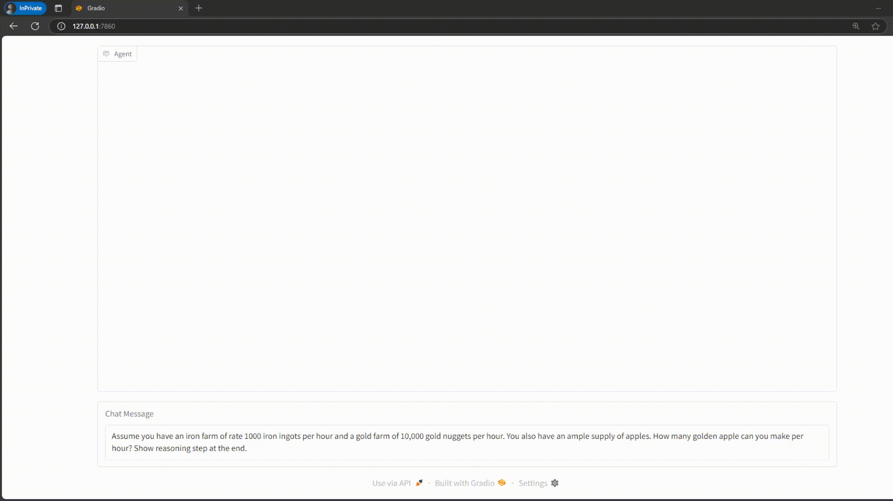
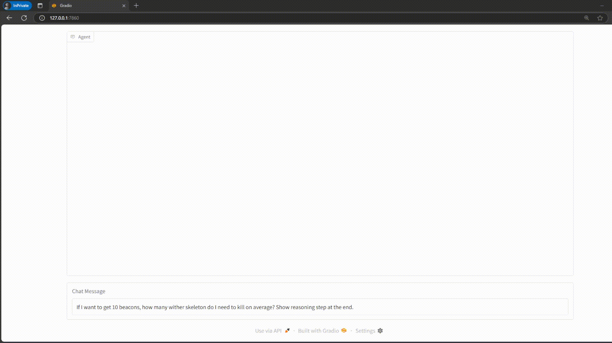
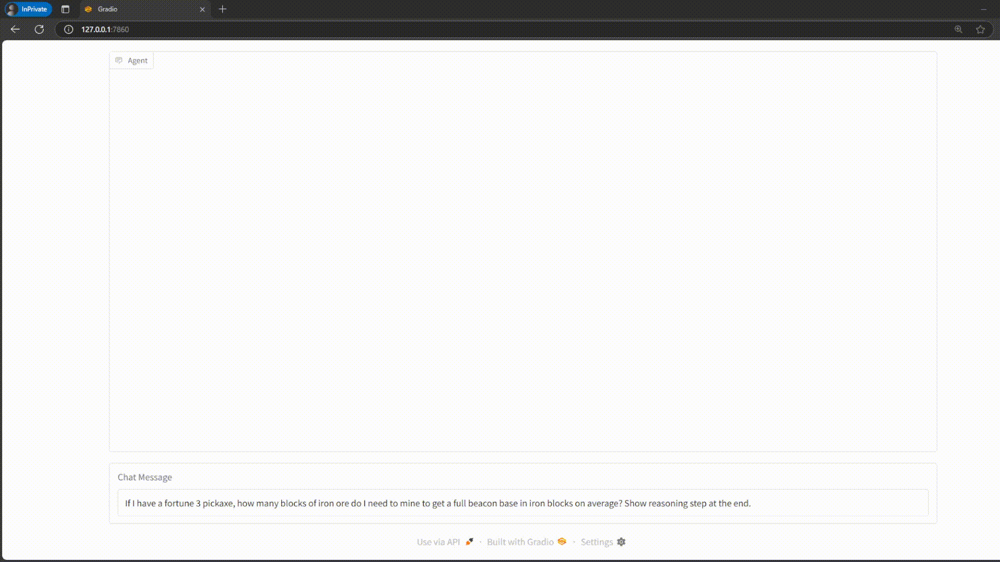

# Hey Steve

Hey Steve is an AI assistant that provides information about Minecraft. 

- Minecraft wiki is scraped as knowledge base. 
- Then, Langchain is used to dynamically chunk the data into paragraphs. 
- Contextual Retrieval is used to assist RAG in finding the most relevant information.
- `ChromaDB` is used to store vectorized data for the RAG. 
- Re-ranking retrieved chunks to ensure accuracy.
- Integrate with `smolagents` so expansion is extremely flexible. 
- Additional tool calling of loot table and recipe to ensure accuracy.

## Run this yourself 

1. Clone the repository
```bash
git clone git@github.com:Minhao-Zhang/HeySteve.git
```
2. Install the requirements
```bash 
conda create -n hey-steve python=3.13.2
pip install -r requirements.txt
```
3. Download all the pages as into `data/downloads`. 
    
    As far as I understand, the content on [minecraft.wiki](https://minecraft.wiki) are licensed under [cc by-nc-sa 3.0](https://creativecommons.org/licenses/by-nc-sa/3.0/deed.en). Thus, I will not include them in here. 

    I provided several files in the `download_scripts` folder. They are all page names as they all share a common prefix of `https://minecraft.wiki/w/`. Thus, I would dynamically pad the URLs with the prefix.
    
    1. You can directly use `sh download_scripts/download_webpages.sh PATH_TO_URL_FILE` to download all the pages. You can see them under `data/downloads`. I used `wget` here since it just does not get banned when I scrape all the pages. 
    2. You could also update the URLs as mine might be outdated. You can run `python hey_steve/processing/get_page_names.py` to get the latest URLs. 

4. Run the `python hey_steve/processing/html_to_markdown.py PATH_TO_URL_FILE` to process the pages into a semi-refined markdown file. In the process, only the essentail text information is kept. 
5. Run the `python hey_steve/processing/chunking.py PATH_TO_DIRECTORY` to precess the pages into individual chunks with context prepended to each chunk. 
6. Optional, you provide the agent with some tools with hard facts about minecraft such as loot table and recipe. Find your minecraft installation, use tools like `7-zip` to extract the `jar` file. Under `data/minecraft` you would find a `recipe` and `loot_table` folder and just copy them into `data/mc`. 
7. Then, you just `python run.py` and you can head to `http://127.0.0.1:7860/` and start asking question. 

## Final data directory 
```text
data/ 
├── chunks/ # chunks in json list files
├── downloads/ # raw html files
├── mc/ # your unzipped minecraft files
└── md/ # converted html files in markdown
```

## Demo Videos





